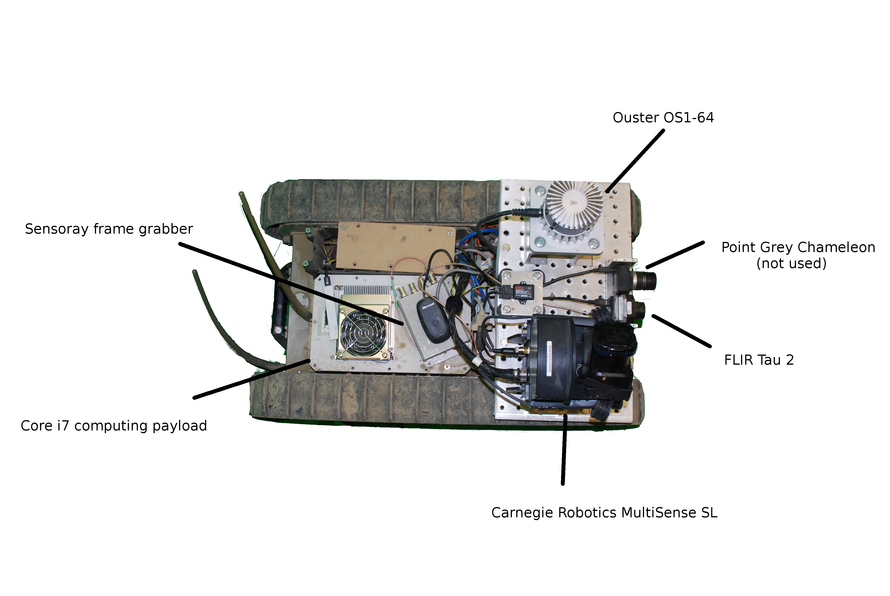
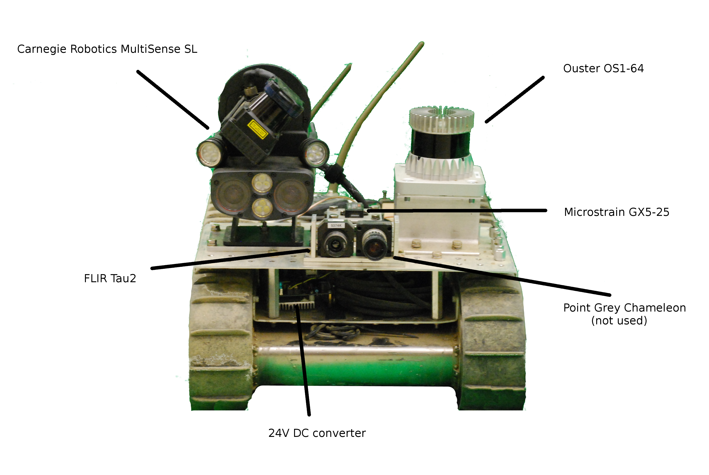

# Tunnel Circuit DataSet README
This quickstart guide outlines how to get started with the SubT Tunnel and Urban Circuit Datasets. For additional details, please refer to our paper about the previous Tunnel circuit. [ICRA paper](https://subt-data.s3.amazonaws.com/SubT_Tunnel_Ckt/ICRA2020_TunnelCktDataset.pdf).                                                                                                                                                                                                           

These datasets were collected by the Army Research Laboratory on behalf of DARPA to support further system development via offline component testing in a relevant environment.

Urban:

The SubT urban dataset consists of four ROS bag files which were recorded on our "GVRbot", which is a modified iRobot PackBot Explorer developed at the Ground Vehicle Systems Center (GVSC), formerly known as TARDEC. This robot is a tracked skid-steer chassis equipped with forward mounted flippers to assist with stair descent as well as traversing taller obstacles. The sensor loadout is similar to the Husky described below in the Tunnel section. The robot is equipped with an Ouster OS1-64 LiDAR mounted in an elevated placement to avoid self-occlusion. The robot is also equipped with a Multisense SL which provides a secondary LiDAR system as well as stereo vision and illumination. We have also added an SCD-30 CO2 sensor for the gas artifact. Unfortunately, the Thermal IR camera(s) mounted on the robots did not record useable data due to a compression parameter mistake.

The message files used to handle the SCD-30 data can be found in the support code described in the tunnel section below. Note that it has been restructured somewhat since the Tunnel circuit to include an additional workspace to support the Kimera VIO analysis which is still a work in progress. There are now two workspaces under the subt_reference_datasets project. Users should probably only focus on the base_ws for now.

On this release, the bag files are compressed with the lz4 option to greatly reduce their size for transmission. On our own analysis, decompressing them during playback is too slow, so they should be decompressed by the user via rosbag decompress prior to use.

Bag file description and links:

Alpha course, upper floor. Configuration 2:
https://subt-data.s3.amazonaws.com/SubT_Urban_Ckt/a_lvl_1.bag

Alpha course, lower floor. Configuration 2. Robot goes down the stairs shortly after start:
https://subt-data.s3.amazonaws.com/SubT_Urban_Ckt/a_lvl_2.bag

Beta course, upper floor. Configuration 2:
https://subt-data.s3.amazonaws.com/SubT_Urban_Ckt/b_lvl_1.bag

Beta course, lower floor. Goes pretty far to get to stairs. Ouster data not available due to equipment failure (DC converter):
https://subt-data.s3.amazonaws.com/SubT_Urban_Ckt/b_lvl_2.bag

Support data for the analysis from the ICRA paper is being processed and will be available at this link:
https://subt-data.s3.amazonaws.com/SubT_Urban_Ckt/support.tgz

Tunnel:

The SubT tunnel dataset consists of three ROS bag files which were recorded on our Clearpath Husky robot during teleoperation within the Safety Research (SR) and Experimental (EX) courses. 
At present, only Configuration B is represented in the dataset due to technical difficulties involved in the early collection process. The dataset consists of two runs in the SR course and one in the EX course.

Bag files have been compressed by "rosbag compress" to reduce download time. They should still play back fine from their compressed state; however, if excessive stuttering or reduced performance is observed, the user can decompress the bag file to their full size (roughly 2x) with "rosbag decompress".

Bag file data can be retrieved from these links:

README/usage/etc: https://subt-data.s3.amazonaws.com/SubT_Tunnel_Ckt/usage.txt

Support data (ground truth, object annotations):

https://subt-data.s3.amazonaws.com/SubT_Tunnel_Ckt/support.tgz

Bag files:

https://subt-data.s3.amazonaws.com/SubT_Tunnel_Ckt/ex_B_route1.bag (33 GB)

https://subt-data.s3.amazonaws.com/SubT_Tunnel_Ckt/sr_B_route1.bag (19.6 GB)

https://subt-data.s3.amazonaws.com/SubT_Tunnel_Ckt/sr_B_route2.bag (16.3 GB)

USAGE:
First, download the publich catkin workspace from : 

git clone git@bitbucket.org:subtchallenge/subt_reference_datasets.git

Build:
```
cd subt_reference_datasets
wstool update -t base_ws/src
wstool update -t kimera_ws/src
. apply_required_build_patches.sh
rosdep install -y --from-paths base_ws/src --ignore-src --rosdistro melodic
rosdep install -y --from-paths kimera_ws/src --ignore-src --rosdistro melodic
cd base_ws
catkin init
catkin config --extend YOUR_ROS_CATKIN_WORKSPACE --merge-devel --cmake-args -DCMAKE_BUILD_TYPE=Release
catkin build
cd ../kimera_ws
catkin init
catkin config --extend ../base_ws/devel --merge-devel --cmake-args -DCMAKE_BUILD_TYPE=Release
catkin build
```
Go to the directory where you have placed the tunnel circuit bag files
```
cd ~/data/tunnel_ckt
roslaunch tunnel_ckt_launch remap.launch bag:=sr_B_route2.bag reproject:=false rate:=2.0 odom_only:=true course:=sr config:=B
```
Arguments:

"bag" : Non-optional argument, specify the bag file to open for this run. This should be specified as a relative path to where CWD where roslaunch is started (it is composed with PWD)

"name" : Default "chinook" matches robot name used in dataset collection. 

"reproject" : Optionally reproject ouster point cloud using new settings. We may provide our ouster projection node at a later date; otherwise, the user may substitute their own or find another alternative.

"reodom" : Attempt to re-generate the platform odometry using joystick commands, to correct poor recorded odometry in configuration A bagfiles (not provided). This is experimental and should not be needed for configuration B runs.

"rate": Bag play rate multiplier.

"mark_artifacts": When set to true, the subt_scoring node will be run in marking mode, which will provide the user with an interface to code the location of artifacts for automatic scoring/ RMSE calculation. Artifacts are already coded in the coded_artifacts directory; however, users may wish to improve the coding as some artifacts were    missed.

"bag_out": If true, capture an output bag file. Currently configured with our internal mapping outputs. Users should modify the rosbag record node to capture relevant data.

"course": should be either "ex" for experimental, or "sr" for safety research

"config": can be either A or B. Note that all bag files were taken in configuration B (for now).


"omnimapper"

"cartographer"

"odom_only"

 These parameters optionally switch on up to one mapping system. The user should be able to source into a catkin workspace from the "subt hello world" virtual challenge codebase to get Cartographer, or set it up on their own. "odom_only" will give the results of using no mapping system by substituting a static map to odom transform. Each    of these options configures the subt_scoring node to write an RMSE output file.

Scoring and RMSE computation are automatically performed by the subt_scoring node, assuming the user's mapping approach provides the map -> chinook/odom transform. 
The node should automatically compute the DARPA frame to map frame correction by aligning to the fiducial landmarks.

The scoring node works by reading the fiducial_ex or fiducial_sr file, the ground truth file for the course configuration, and a coding file with timestamped local artifact detections. 
Fiducial tracks were automatically inserted into the coding file. The global "darpa" to map frame transform is established when 3 fiducials have been observed and is revised when the fourth fiducial is observed. 
Fiducial tracking was performed automatically by the coding node and is inserted into the coding file. Only the final observation of each fiducial is used, under the assumption that this one is the closest to the vehicle and therefore will have the best range accuracy.
Scores are updated when an artifact is observed via composing the darpa -> map frame + the user's map-> chinook/odom frame correction with the recorded chinook/odom -> chinook/base transform and the coded local position. This resulting global position is compared with the ground truth file; a point is scored if the position is within 5     meters of an artifact with the same label. RMSE is updated by all artifact reports even if they are too inaccurate to achieve a scored point.

The scoring node works by reading the fiducial_ex or fiducial_sr file, the ground truth file for the course configuration, and a coding file with timestamped local artifact detections. 
Fiducial tracks were automatically inserted into the coding file. The global "darpa" to map frame transform is established when 3 fiducials have been observed and is revised when the fourth fiducial is observed. 
Fiducial tracking was performed automatically by the coding node and is inserted into the coding file. Only the final observation of each fiducial is used, under the assumption that this one is the closest to the vehicle and therefore will have the best range accuracy.
Scores are updated when an artifact is observed via composing the darpa -> map frame + the user's map-> chinook/odom frame correction with the recorded chinook/odom -> chinook/base transform and the coded local position. This resulting global position is compared with the ground truth file; a point is scored if the position is within 5     meters of an artifact with the same label. RMSE is updated by all artifact reports even if they are too inaccurate to achieve a scored point.


# STIX DataSet README

## Equipment
The STIX datasets were collected with a refurbished iRobot Packbot Explorer, which has been designated "GVRBot". This robot has been augmented with many sensors which are representative of an entry to the DARPA SubT challenge. The sensor modalities chosen represent a superset of typical configurations; this allows a team to experiment with various combinations to evaluate their applicability to the SubT challenge on their specific software.

The robot is equipped with an Ouster OS1-64 (3D LiDAR) , a FLIR Tau2 thermal IR camera, a Carnegie Robotics Multisense SL stereo camera + illuminators + spinning LiDAR, and a Microstrain GX5-25 IMU. The robot was also equipped with a Point Grey Chameleon which was a spare device and not used in this data collection. Data was saved onto an SSD in the computing payload.





## Software
The data sets were collected using ROS drivers for sensor components where available. Imagery was collected in compressed or compressedDepth format to reduce file sizes. These can be reconstructed to their raw form through the use of image_transport "republish" ROS nodes, or by using image_transport when subscribing to the topics.
### Ouster OS1-64
Uses https://github.com/ouster-lidar/ouster_example driver. Has been modified to tag output with current system time (ros::Time::now()) instead of just using device timestamp, which starts at zero. The timestamp on the device was not set due to lack of supporting hardware on our part, which will be rectified in future collections. To reduce jitter, the offset between system time and device time is continuously estimated, and composed with the device time to get something closer which will only be offset by an unknown delay parameter. 

We have recorded the ouster packets directly to support re-generating the clouds, perhaps with better estimates of time delay, if desired. In addition, the OS1 device generates its own internal IMU data, which would have the correct timestamps for the LiDAR points. We have recorded this but not used it yet. Finally, the point clouds are also recorded at 10 Hz.

### Multisense SL
Uses full driver stack provided by Carnegie Robotics. Device was calibrated at the factory. We attempted to capture all relevant topics and calibration data.

### FLIR Tau2
We have provided the thermal IR data from this sensor, on the topic 

cv_camera/image_raw/compressed. 

Intrinsic calibration of this sensor was not performed, so the camera_info message should not be used as is. An interested user could attempt to calibrate by looking at common features between the thermal IR image and the Multisense SL, such as lights whcih show up in both.


### Microstrain IMU
Raw microstrain imu data is recorded. This is also incorporated with the platform's odometry (which is also recorded separately) into a gvrbot/odom to gvrbot/base (base\_link?) frame. This can be stripped out if desired through the use of the tf_hijacker node which is provided in the bitbucket site at
https://bitbucket.org/subtchallenge/subt_reference_datasets/src/master/.
This project also contains helpful launch files which can be used to run these bag files.

## Other considerations

We were running our own mapping system while collecting this data, which results in the TF tree containing a map to gvrbot/odom frame. When evaluating your own mapping system, this frame will need to be stripped through the use of the tf_hijacker node, which is provided in the bitbucket site.

The FLIR data cuts out near the end of the long loop bag file. 

Extrinsic calibration of sensor positions is quite rough and might be insufficient to generate really accurate maps. Sufficiently motivated parties could use the tf_hijacker node to remove inaccurate transforms which could then be re-inserted through the use of a tf2_ros/static_transform_publisher.


## Run notes

1. subt\_edgar\_hires\_2019-04-11-13-31-25.bag  
  * Description: Main loop plus drilling museum. Total length ~26 minutes  
  * Problems:  
  
    1. FLIR cuts out at 959 seconds out of 1599 seconds of total run. This means that we didn't see the last Rescue Randy near the ARMY entrance. The robot was in the paved concrete branch off of the ARMY tunnel. FLIR also would have been useful to see at least one more cell phone at the ARMY tunnel  
    
    2. Got a good look at the ARMY tunnel entrance gate as well as the initial MIAMI tunnel entrance, but the bag file stops short of re-observing the MIAMI tunnel and getting back in to close the loop. A team was setting up for their run by the time we got back to the MIAMI staging area.  
    
2. Smoke tests  
  * subt_edgar_hires_2019-04-12-15-46-54.bag  
    - Has FLIR, starts just outside the smoke and makes an approach to the "survivor".
    
  * subt_edgar_hires_2019-04-12-15-52-44.bag  
    - No FLIR data in this run, but still has other sensors. Sees survivor a few more times  
    
3. Dust tests:  
  * Three bag files here with good FLIR and all sensors working correctly. These bag files are taken at the steep incline at the back on the MIAMI tunnel. The robot follows closely behind a person who is kicking up a lot of dust into the air.  
